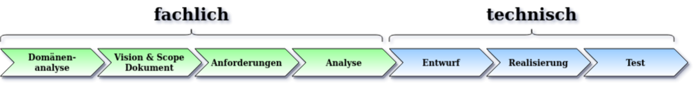

 

    <a href="#über-dieses-projekt">Über dieses Projekt</a> • 
    <a href="#wer-bin-ich">Wer bin ich</a> •
    <a href="#datenschutz">Datenschutz</a> •
    <a href="#code-of-conduct">Code of Conduct</a> •
    <a href="#arbeitssprache">Arbeitssprache</a> •
    <a href="#meine-dokumentation">Meine Dokumentation</a> •
    <a href="#lizenzierung">Lizenzierung</a> •
    <a href="#informationen-zur-teilnahme">Informationen zur Teilnahme</a> •

## Über dieses Projekt

Ich erstelle dieses Projekt als Übung für ein Informatik Fernstudium im Modul Software Engineering. Das Vorgehen und 
auch die entstehenden Artefakte sind an die Lehrinhalte aus dem genannten Modul angelehnt. Mittels eines praktischen 
Beispiels sollen die Lehrinhalte sprechender und das Gelernte vertieft werden.

Bei manche Aspekten, wie beispielsweise das inhaltliche Layout, habe ich mich von dem 
Projekt [Corona Warn-App](https://github.com/corona-warn-app/cwa-documentation) inspirieren lassen.

**Zusammenfassung des Zielbildes**

Innerhalb dieses Projektes wird eine kleine Anwendung erstellt mit der man sich mit einem beliebigen E-Mail Postfach 
verbinden kann. In einer kleinen Benutzeroberfläche werden die einzelnen E-Mails in einer Tabelle angezeigt und der
Benutzer ist in der Lage mehrere E-Mails zu markieren und als PDF Dokument zu exportieren. Er kann dabei das 
Zielverzeichnis, in das die PDFs erzeugt werden, angeben. Weiterhin kann er für den Dateinamen der PDFs eine Vorlage
definieren, sodass z.B. das Datum des Eingangs und der Betreff im Dateinamen abgelegt werden.

Für die Realisierung wird der komplette Software Engineering Prozess durchlaufen.
Details zu den einzelnen Dokumenten befinden sich im Abschnitt [Meine Dokumentation](#Meine-Dokumentation)

## Wer bin ich

Ich bin ein ausgebildeter Informatiker im Bereich Anwendungsentwicklung und habe bereits über 10 Jahre Berufserfahrung.
Die überwiegende Zeit wurde ich als Fullstack Java Entwickler eingesetzt. Dabei habe ich Java und Android Rich Clients 
erstellt mit den Technologien: Android, SWT, Swing, JavaFX 
Die meisten Anwendungen wurden in einer Client-Server Architektur betrieben, sodass ich auch für die Realisierung des
Backends verantwortlich war, welches ebenfalls in Java erstellt wurde. Hier kamen Technologien wie: Servlets, EJB, JPA,
Hibernate und viele mehr zum Einsatz. 
Natürlich wurden bei diesen Anwendungen auch Datenbanken genutzt. Hier bin ich vertraut mit: MySQL, MSSQL, Oracle, H2.   

Im Jahr 2020 habe ich mich für ein Fernstudium an der Hochschule Trier entschieden, um den Master of Science im Bereich
Informatik zu erreichen. Es handelt sich hierbei um ein zertifikatsbasiertes Fernstudium, welches ich neben meiner normalen
Betrufstätigkeit absolviere.

## Datenschutz

Diese Anwendung ist eine reine Client-Anwendung und kommt ohne eigenständigen Server aus. Während der Benutzung müssen 
Zugangsdaten für E-Mail Postfächer eingegeben werden, jedoch werden diese Zugangsdaten und auch sonst keine Daten 
gespeichert.

Da dieses Übung als Open-Source-Projekt realisiert wurde, kann jeder dies überprüfen. 
Ich begrüße jede konstruktive Rückmeldung!

## Code of Conduct

Dieses Projekt hat den [Contributor Covenant](https://www.contributor-covenant.org/) in Version 1.4 (deutsche Fassung) 
als unseren Code of Conduct übernommen. Bitte beachten Sie die Einzelheiten in unserem 
[CODE_OF_CONDUCT.md](CODE_OF_CONDUCT.md). Alle Mitwirkenden müssen sich an den Code of Conduct halten.

## Arbeitssprache

Ich entwickle diese Anwendung als Übung für mein Studium. Daher ist die Arbeitssprache für dieses Projekt, 
alle Dokumente in der Dokumentation und alle Kommentare im Code, Deutsch.

## Meine Dokumentation

Dieses Repository enthält die komplette Übung mit der vollständigen Dokumentation und der Realisiereung.

* [Domänenanalyse](dokumentation/Domaenenanalyse.md)
* [Vision & Scope Dokument](dokumentation/Vision-Scope-Dokument.md)
* [Anforderungen](dokumentation/Anforderungen.md)
* [Analyse](dokumentation/analyse.md)
* Entwurf
* Realisierung
* Test

<!-- 
TODO
Prüfen, ob eine Realisierung der technischen Dokumentation mittels maven sites auf github möglich ist.
Unterscheidung zwischen fachlichen Akzeptanztests und technischen Tests wie Unit und Integration.
-->

## Projekte

Bei diesem Vorhaben werden Github-Projekte für die Aufgabenverwaltung genutzt. Als Projekttyp wird ein einfaches 
Kanban Projekt genutzt.

## Lizenzierung

Copyright (c) 2020 Thomas Gattinger.

Lizenziert unter **Apache-Lizenz, Version 2.0** (die "Lizenz"). Sie dürfen diese Datei ausschließlich im Einklang mit 
der Lizenz verwenden.

Eine Kopie der Lizenz erhalten Sie unter https://www.apache.org/licenses/LICENSE-2.0.

Sofern nicht durch anwendbares Recht gefordert oder schriftlich vereinbart, wird jede unter der Lizenz bereitgestellte 
Software „OHNE MÄNGELGEWÄHR“ UND OHNE AUSDRÜCKLICHE ODER STILLSCHWEIGENDE GARANTIE JEGLICHER ART bereitgestellt. 
Die genauen Angaben zu Genehmigungen und Einschränkungen unter der Lizenz finden Sie in der [LIZENZ](LICENSE).

Das "Mail to PDF Konverter"-Logo basiert auf einem freien Icon auf Basis einer Freeware Lizenz, welches für diese 
Zwecke leicht modifiziert wurde. Weitere Informationen finden Sie unter 
[www.iconarchive.com](https://www.iconarchive.com/show/filetype-icons-by-graphicloads/pdf-icon.html).

## Informationen zur Teilnahme

Weitere Informationen z.B. darüber, wie Sie das Projekt unterstützen können, unser Team aufgebaut ist oder unsere 
Projektstruktur aussieht, finden Sie hier: [CONSTRIBUTING.md](CONSTRIBUTING.md).
