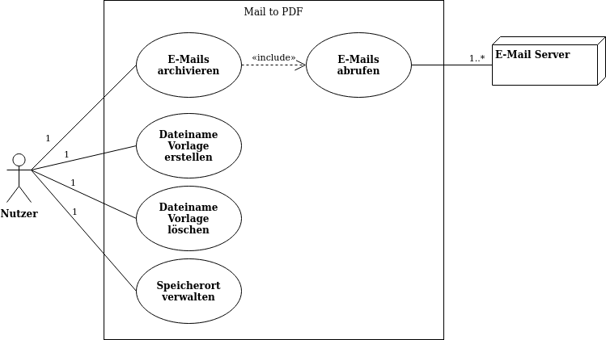

# Anforderungen

## Nicht-Funktionale Anforderungen

### Qualitätsanforderungen

Bei der Betrachtung der Qualitätsanforderungen werden die Merkmale wie sie im IEEE 1061-1998 Stanard aufgeführt sind
berücksichtigt. Dabei wird jedem Merkmal eine Wichtigkeit zugeordnet, sowie eine Beschreibung, wie geplant ist das
Merkmal zu erfüllen.

Der Bereich der Wichtigkeit geht von 0 _(absolut unwichtig -> wird nicht berücksichtigt)_ 
bis 10 _(extrem wichtig -> wird zwingend berücksichtigt)_.
 

Merkmal              | Wichtigkeit | Beschreibung
---------------------|-------------|-------------
Portabilität         | 2           | Primär soll als Betriebssystem Windows 7 und 10, sowie Ubuntu 18.04 (Linux) unterstützt werden. 
Performance          | 3           | Die E-Mails sollen in einer überschaubaren Zeit als PDFs archiviert werden. Dabei ist ein maximaler Wert von 10 Sekunden pro E-Mail nach dem Anstoßen der Archivierung einzuhalten.
Wiederverwendbarkeit | 0           | Es wird keinen Wert auf Wiederverwendbarkeit gelegt. 
Zuverlässigkeit      | 8           | Es wird eine hohe Zuverlässigkeit erwartet. Von 1.000 E-Mails, darf maximal eine E-Mail fehlerhaft gespeichert werden.
Wartbarkeit          | 9           | Die Quellcode muss verständlich und gut strukturiert erstellt werden. Jede öffentliche Java Methode ist mit JavaDoc zu dokumentieren. 
Effizienz            | 0           | Die Anwendung darf so viel Ressourcen für die Aufgabe beziehen wie es benötigt.
Integrität           | 5           | Der Zugriff auf die E-Mail Postfächer geschieht über sichere Protokolle. Darüber hinaus sind keine weiteren Maßnahmen zur Sicherheit und dem Schutz vor unbefugtem Zugriff zu treffen.
Verfügbarkeit        | 10          | Das System soll als reine Client-Anwendung realisiert werden und steht somit nach Auslieferung zu 100% der Zeit zur Verfügung.
Benutzbarkeit        | 8           | Die Anwendung soll einfach und intuitiv bedienbar sein, sodass die Benutzung innerhalb weniger Minuten von einem erfahrenen EDV Anwender erlernt werden kann.
Interoperabilität    | 3           | Die Anwendung muss in der Lage sein mit verschiedenen Postfächern über IMAP E-Mails abzurufen und integrierte Bibliotheken zur Erzeugung von PDF Dokumenten nutzen können. 
Erweiterbarkeit      | 8           | Die Anwendung soll möglichst modular aufgebaut werden, sodass eine Erweiterung um neue Features möglich ist. Metrik: Neuer einfacher Dialog -> Max. 1 PT, Neuer mittlerer Dialog -> Max. 4 PT, Neuer komplexer Dialog -> Max. 8 PT
Robustheit           | 7           | Offensichtliche Fehleingaben sollen von der Anwendung erkannt und dem Benutzer gemeldet werden. Bei unerwarteten Fehlern, sollen diese ebenfalls protokolliert und gemeldet werden. Nur in sehr seltenen Fällen darf die komplette Anwendung abstützen.
Testbarkeit          | 10          | Die Anwendung und ihre Bestandteile müssen so erstellt werden, dass diese vollständig automatisiert testbar sind. Außerdem muss SonarCube für die statische Code Analyse eingesetzt werden und eine Testabdeckung bei den Modultest von mindestens 90% vorliegen.

### Randbedingungen

#### Technisch

Merkmale           | Beschreibung
-------------------|-------------
Hardware           | Die Hardware ist nicht älter als 5 Jahre sein (Stand 2020).
Betriebssystem     | Es sollen mindestens folgende Betriebssysteme unterstützt werden: Windows 7, Windows 10, Linux Mint 19.3.
Datenbank          | Es steht keine zentrale Datenbank zur Verfügung.
Programmiersprache | Es wird keine spezielle Programmiersprache erwartet.

#### Organisatorisch

Merkmale           | Beschreibung
-------------------|-------------
Termine            | Die Termine aus dem Vision&Scope Dokument Abschnitt [Projektpriorität](Vision-Scope-Dokument.md#Projektpriorität) müssen eingehalten werden.
Sprache            | Die Sprache aller Dokumente, sowie der technischen Dokumentation ist Deutsch.
Vorgehensweise     | Alle Aufgaben werden in einem GitHub Projekt erstellt und abgearbeitet. Fehler werden über entsprechende Bug-Tickets auf GitHub gemeldet. Verbesserungsvorschläge werden über entsprechende Feature-Tickets auf GitHub gemeldet.
Abnahme von Tests  | Eine erfolgreiche Abnahme ist dann gegeben, wenn durch den SonarCube keine gravierenden Mängel mehr festgestellt werden.

## Funktionale Anforderungen

### Übersicht der Epics

Die Funktionen der Anwendung sind in verschiedene Bereiche aufgeteilt. Diese Bereiche spiegeln sich in den nachstehenden
Epics wider:

**Bereiche der Anwendung**

Nr.| Epic                 | Beschreibung
---|----------------------|-------------
 1 | E-Mail und Postfach  | Alle Funktionalitäten, die mit dem Verbinden zu Postfächern oder dem Abrufen und Anzeigen von E-Mails zu tun haben.
 2 | Archivierung als PDF | Alle Funktionalitäten, die mit der Auswahl und der Archivierung von E-Mails als PDF zu tun haben.
 3 | Konfigurationen      | Alle Funktionalitäten, die mit Konfigurationen im Allgemeinen zu tun haben, ohne direkt zu den beiden anderen Bereichen zu gehören. 

### Übersicht der User Storys

Die Anforderungen an die **Mail to PDF** Anwendung, die den fachlichen Umfang betreffen, sind nachfolgend in der 
übrlichen Form aus Sicht der nutzenden Personen formuliert, sofern nicht anders angegeben:

_"Als <Stakeholder> möchte ich <Handlung durchführen>, um <gewünschtes Ergebnis zu erzielen>."_

Zu jeder User Story werden entsprechende Akzeptanzkriterien definiert, die die Spezifikation um konkrete Beispiele
ergänzen und für die Abnahme relevant sind. Dabei werden die Akzeptanzkriterien in einer natürlichsprachigen formalen
Sprache (Gherkin) formuliert, um diese als automatisierte Tests realisieren zu können.

#### E-Mail und Postfach

 User Story ID | Priorität | User Story | Akzeptanzkriterien
---------------|-----------|------------|-------------------
 E01.01        | 1         | Als Nutzer der Anwendung möchte ich nach dem Start der Anwendung eine Anmeldemaske für ein E-Mail Postfach sehen, um mich über diese Maske an einem Postfach anzumelden. | 1. Eingabefelder für Anmeldung am E-Mail Postfach stehen zur Verfügung. 
 2. Nutzer meldet sich erfolgreich an einem E-Mail Postfach an.
 E01.02        | 5         | Als Nutzer der Anwendung möchte ich bei einer misslungenen Anmeldung einen Fehlerhinweis erhalten. | Nutzer bekommt einen Hinweis angezeigt, wenn die Anmeldung fehl schlägt.
 E01.03        | 3         | Als Nutzer der Anwendung möchte ich, dass nach erfolgreicher Anmeldung alle E-Mail Köpfe automatisch angezeigt werden. | Anzeige aller E-Mail Köpfe nach erfolgreicher Anmeldung 

#### Archivierung als PDF

 User Story ID | Priorität | User Story | Akzeptanzkriterien
---------------|-----------|------------|-------------------
 E02.01        | 1         | Als Nutzer der Anwendung möchte ich mehrere E-Mails markieren können, um beim Archivieren mehrerer E-Mails Zeit eingespart wird. | 1. Nutzer markiert mehrere E-Mails. 
 2. Nutzer entfernt Markierung von bereits markierten E-Mails.
 E02.02        | 1         | Als Nutzer der Anwendung möchte ich alle markierten E-Mails als PDF exportieren können. | 1. Archivierung von mehreren E-Mails ohne Anhang in Abhängigkeit des vorkonfigurierten Dateinamen Templates. 
 2. Archivierung mehrerer E-Mails mit Anhang in Abhängigkeit des vorkonfigurierten Dateinamen Templates. 
 3. Export zweier E-Mails deren generierter Dateiname identisch ist und eine Laufende Nummer erzeugt wird.
 E02.03        | 3         | Als Nutzer der Anwendung erwarte ich bei entsprechender Konfiguration, dass erfolgreich archivierte E-Mails aus dem Postfach gelöscht werden. | Sofern in der Konfiguration das Löschen aktiviert ist, werden archivierte E-Mails gelöscht.

#### Konfigurationen

 User Story ID | Priorität | User Story | Akzeptanzkriterien
---------------|-----------|------------|-------------------
 E03.01        | 3         | Als Nutzer der Anwendung möchte ich Templates für Dateinamen der archivierten Dateien erstellen | Erstellung und Speicherung eines neuen Templates für Dateinamen.
 E03.02        | 1         | Als Nutzer der Anwendung möchte ich vorhandene Templates für Dateinamen der archivierten Dateien einsehen können | Anzeige vorhandener Templates für Dateinamen.
 E03.03        | 4         | Als Nutzer der Anwendung möchte ich vorhandene Templates für Dateinamen der archivierten Dateien löschen können | Löschen eines vorhandenen Templates.

### Übersicht der grundlegenden Anwendungsfälle

Die User Storys dienen dazu die Welt des Kunden besser zu verstehen. Um aber einen besseren Einblick in die konkreten 
Arbeitsschritte für eine Aufgabe oder einen Kundenwunsch zu erhalten, werden Anwendungsfälle erstellt. Die 
Anwendungsfälle bilden einen kompletten Arbeitsprozess ab und kann daher mehrere User Storys abdecken. Jeder
Anwendungsfall wird im Anschluss durch ein UML Use Case Diagramm visualisiert.

**Name:** E-Mails abrufen 
**Kurzbeschreibung:** Ein Benutzer kann sich an einem E-Mail Server anmelden und E-Mails abrufen. 
**Nr.:** GA01 
**Vorbedingung:** Der Nutzer besitzt ein gültiges E-Mail Postfach. 
**Nachbedingung:** keine

Vorhaben des Anwenders                    | Verantwortlichkeit des Systems
------------------------------------------|-------------------------------
Nutzer startet die Mail to PDF Anwendung. | Anwendung zeigt nach dem Starten eine Anmeldemaske für ein E-Mail Postfach an.          
Nutzer gibt seine Anmeldedaten in die Anmeldemaske ein und startet den Anmeldevorgang | <ul><li>Anwendung übermittelt die Anmeldedaten an den E-Mail Server.</li><li>Wenn der Anmeldevorgang fehl schlägt, dann zeigt die Anwendung einen entsprechenden Hinweis dem Nutzer.</li><li>Wenn die Anmeldung erfolgreich war, werden alle E-Mail Köpfe abgerufen und angezeigt.</li></ul>

**Name:** E-Mails archivieren 
**Kurzbeschreibung:** Ein Benutzer kann E-Mails auswählen und diese als PDFs zusammen mit den herunterladenen Anhängen archivieren. 
**Nr.:** GA02 
**Vorbedingung:** keine
**Nachbedingung:** keine

Vorhaben des Anwenders                      | Verantwortlichkeit des Systems
--------------------------------------------|-------------------------------
Nutzer wählt eine oder mehrere E-Mails aus. | Anwendung markiert die vom Nutzer ausgewählten E-Mails.
Nutzer startet den Archivierungsvorgang.    | <ul><li>Anwendung lädt jede markierte E-Mail vollständig vom E-Mail Server herunter.</li><li>Jeder E-Mail Inhalt wird in ein eigenes PDF-Dokument konvertiert.</li><li>Alle Dateien erhalten einen Dateinamen, der durch ein Template aus dem Konfigurationsbereich bestimmt wird.</li><li>Die Dateien werden unter einem Pfad abgelegt, der im Konfigurationsbereich hinterlegt wurde.</li><li>Die Anwendung meldet dem Nutzer das Ergebnis der Archivierung mit.</li></ul>

**Name:** Dateiname Vorlage erstellen 
**Kurzbeschreibung:** Ein Benutzer kann eine Vorlage für Dateinamen der PDF Dateien und Anhängen erstellen. 
**Nr.:** GA03 
**Vorbedingung:** keine
**Nachbedingung:** keine

Vorhaben des Anwenders                    | Verantwortlichkeit des Systems
------------------------------------------|-------------------------------
Nutzer startet die Mail to PDF Anwendung und wechselt in den Konfigurationsbereich für Dateinamen Vorlagen. | Anwendung zeigt alle vorhandenen Vorlagen an.  
Nutzer erstellt eine neue Vorlage.        | Anwendung erstellt eine neue leere Vorlage und bietet dem Nutzer folgende Parameter für die Vorlage an: <ul><li>Empfangsdatum</li><li>Sendedatum</li><li>Empfänger</li><li>Weitere Empfänger</li><li>Absender</li><li>Betreff</li></ul>
Nutzer vergibt der Vorlage einen eindeutigen Namen, wählt einen oder mehrere Parameter aus sowie noch weitere statische Informationen und speichert die Vorlage ab. | Anwendung speichert die vom Nutzer erstellte Vorlage und zeigt diese unter den verfügbaren an.
Nutzer wählt unter den verfügbaren Vorlagen die neu erstellte Vorlage aus, die als Standard-Vorlage künftig genutzt werden soll. | Anwendung kennzeichnet die neue Vorlage als Standard-Vorlage und speichert diese Information ebenfalls ab.

**Name:** Dateiname Vorlage löschen 
**Kurzbeschreibung:** Ein Benutzer kann eine Vorlage für Dateinamen der PDF Dateien und Anhängen löschen 
**Nr.:** GA04 
**Vorbedingung:** Es muss neben einer Default-Vorlage noch eine weitere Vorlage existieren.
**Nachbedingung:** Es muss mindestens eine Default-Vorlage existieren.

Vorhaben des Anwenders                    | Verantwortlichkeit des Systems
------------------------------------------|-------------------------------
Nutzer startet die Mail to PDF Anwendung und wechselt in den Konfigurationsbereich für Dateinamen Vorlagen. | Anwendung zeigt alle vorhandenen Vorlagen an.
Nutzer wählt eine oder mehrere Vorlagen aus. | Anwendung markiert die vom Nutzer ausgewählten Vorlagen.
Nutzer startet die Löschung.              | Anwendung löscht alle markierten Vorlagen aus dem System und aktualisiert die Anzeige.

**Name:** Speicherort verwalten 
**Kurzbeschreibung:** Ein Nutzer kann den Speicherort, an dem die archivierten Dateien abgelegt werden einstellen. 
**Nr.:** GA05 
**Vorbedingung:** keine
**Nachbedingung:** keine

Vorhaben des Anwenders                    | Verantwortlichkeit des Systems
------------------------------------------|-------------------------------
Nutzer startet die Mail to PDF Anwendung und wechselt in den Konfigurationsbereich für den Speicherort der archivierten Dateien. | Anwendung zeigt den aktuellen Speicherort an.
Nutzer gibt einen neuen Speicherort an.   | Anwendung speichert neuen Speicherort.
