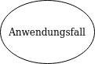
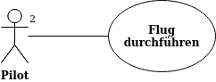
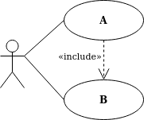
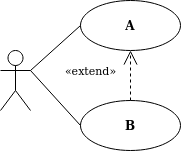
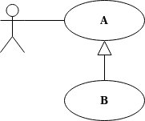
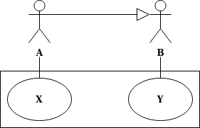
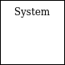
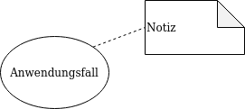

# Übersicht aller UML 2 Diagramme

## Einsetzbarkeit in Phasen

Im folgenden werden die verschiedenen UML Diagramme den Phasen des Wasserfall Modells zugeordnet.

Diagramm               | Anforderungen | Analyse | Entwurf | Realisierung | Test
-----------------------|:-------------:|:-------:|:-------:|:------------:|:---:
Anwendungsfalldiagramm | X             | X       |         |              |
Klassendiagramm        |               |         |         |              |
Zustandsdiagramm       |               |         |         |              |
Sequenzdiagramm        |               |         |         |              |
Aktivitätsdiagramm     |               | X       | X       | x            | X

## Anwendungsfalldiagramm

### Verfügbare Elemente

Element                 | Symbol                                                       | Beschreibung
------------------------|:------------------------------------------------------------:|-------------
**Akteur**              |   | _Wer benutzt das System?_ Ein Aktuer kann sein  <ul><li>ein Benutzer</li><li>eine Softwate (z.B. Webservice, Andere Programme)</li><li>eine Hardwarekomponente</li></ul>. Dabei wird immer nur eine Rolle von Benutzern dargestellt. Niemals eine einzelne Person selbst. Beide Symbole sind gleichwertig und können für menschliche und nicht-menschliche Akteure genutzt werden. Es wird bei Aktueren zwischen primären und passiven Akteuren unterschieden.
**Anwendungsfall**      |  | _Was machen die Akteure?_ Folge von Schitten, um ein fachliches Ziel zu erreichen, ohne technische Details. Dabei ist es wichtig, dass der beschriebene Anwendungsfall auch einen Nutzen erzeugt.
**Assoziation**         |     | _Wer steht mit wem in Beziehung?_ Beziehungen geben an, welche Akteure zu welchen Anwendungfällen gehören und diese auslösen. Dabei können diese Beziehungen Multiplizitäten besitzen. Sind keine angegeben, wird implizit * angenommen, also beliebig viele. In dem Beispiel hier fliegen genau zwei Piloten ein Flugzeug. Der Flug ansich kann jedoch beliebig häufig durchgeführt werden. In der Regel wird auf Seite des Anwendungsfalls nie eine Multiplizität angegeben.
**«include» Beziehung** |         | **A → »base use case«** Ein Basis-Anwendungsfall benötigt "B", um die Funktionalität sicher zu stellen. **B → »included use case«** Ein inkludierter Anwendungsfall kann auch separat ausgeführt werden.
**«extend» Beziehung**  |          | **A → »base use case«** Das Verhalten von "B" kann in "A" eingefügt werden. "A" kann aber auch nur alleine ausgeführt werden. Die Nutzung von "B" ist also optional. In den Anwendungsfällen können Erweiterungsstellen (extension points) definiert werden. Die Ausführung des extending use cases wird dann an eine Bedingung geknüpft, die in Form einer Notiz an die Beziehungslinie annotiert wird. In der Praxis wird dies aber nur sehr selten gemacht.  **B → »extending use case«** Kann ebenfalls für sich alleine ausgeführt werden.
**Generalisierung bei Anwendungsfällen** |  | Anwendungsfälle können von anderen Anwendungsfälle erben. Dabei werden auch alle Beziehungen geerbt. Der übergeordnete Anwendungsfall kann dabei als abstrakt ({abstract}) definiert werden.
**Generalisierung bei Akteuren** |  | Aktuere können ebenfalls von anderen Aktueren erben. In diesem Fall nutzen die Spezialisierungen alle Anwendungsfälle, die auch durch die Generalisierung genutzt werden. In dem Beispiel kann X nur von A genutzt werden. Während Y sowohl von B als auch von A genutzt werden kann. XOR Beziehungen werden ebenfalls mit Generalisierung realisiert, indem die beiden "Oder" Aktuere von einem weiteren Akteur erbt, der dann abstrakt sein kan und einen Anwendungsfall nutzt.  
**System**              |          | _Was wird beschrieben?_ Gibt das System an mit dem ein Akteur interagiert und in dem die Anwendungsfälle ablaufen.
**Notiz**               |           | Notizen sind möglich sollten aber auf keinen Fall den Anwendungsfall beschreiben, da die Beschreibung von Anwendungsfällen viel zu lange ist für eine Notiz.

### Übungen

**Aufgabe 1: "Rechner herunterfahren"**

Sie fahren Ihren Rechner herunter, indem Sie "Start -> "Herunterfahren" wählen. 
Das System beendet dann alle Programme und fährt herunter. 
Manchmal kommt es vor, dass ein Programm abstürzt und das System nicht heruntergefahren werden kann. Dann erhält der 
User den "Sofort beenden" Dialog.

_Lösung_

**Aufgabe 2: Geldautomat**

Ein Kunde kann am Geldautomat seinen Kontostand abfragen oder Geld abheben (ab 50 Euro in 50-Euro-Schritten). 
Der Kunde braucht eine Bankkarte und eine PIN (personal identification number), um das System nutzen zu können. 
Das System verbindet sich mit einem zentralen Bankserver um Details zu Kunde und Konto zu erfahren (Kontostand, korrekte Geheimzahl etc.). 
Der Geldautomat stellt keine Quittungen aus. 
Der Geldautomat wird von professionellem Servicepersonal gewartet.

_Lösung_

## Klassendiagramm

### Verfügbare Elemente

Element                 | Symbol                                                       | Beschreibung
------------------------|:------------------------------------------------------------:|-------------

## Zustandsdiagramm

### Verfügbare Elemente

Element                 | Symbol                                                        | Beschreibung
------------------------|:-------------------------------------------------------------:|-------------
Startzustand            |  | Jedes Zustandsdiagramm besitzt genau ein Startzustand, der als Einstieg dient und direkt in einen Folgezustand führt.
Zustand                 |            | Ein Zustand bildet eine Situation ab, in der spezielle Bedingungen gelten. Ein Zustand kann Aktivitäten besitzen, wie <ul><li>Eintrittsaktivität (entry)</li><li>Austrittsaktivität (exit)</li><li>Andauernde Aktivität (do)</li><li>Weitere Aktivitäten (eventname)</li></ul>
Zustandsübergänge       |      | Zuständsübergänge (Transitions) gibt an von welchem Zustand mit welchem Ereignis (Event) man in einen anderen Zustandgelangt. Die Übergänge können Bedingungen (Guards) besitzen, sodass nur dann der Übergange erfolgt, wenn die Bedingung zu true ausgewertet wird. Außerdem können bei Übergängen noch Aktionen (Effekte) ausgeführt werden. Es gibt verschiedene Ereignistypen bei Zustandsübergängen. <ul><li>CallEvent → Empfang einer Nachricht (Operationsaufruf)</li><li>SignalEvent → Empfang eines Signals (mouseover)</li><li>ChangeEvent → Eine Bedingung wird wahr (when(x<y)</li><li>TimeEvent → zeitablauf oder Zeitpunkt (after(5 sec)</li></ul>
Entscheidungsknoten     |  | Entscheidungsknoten können dafür genutzt werden mehrere Verzweigungen mittels einer Bedingung zu ermöglichen. Es gibt jedoch ein Problem, wenn die Bedingungen nicht alle Möglichkeiten abdecken. In so einem Fall würde man in dem Entscheidungsknoten hängen bleiben. Daher sollte immer die äquivalente Schreibweise in wie  folgendem Beispiel gezeigt genutzt werden!   
