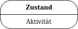
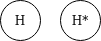

# Übersicht aller UML 2 Diagramme

## Einsetzbarkeit in Phasen

Im folgenden werden die verschiedenen UML Diagramme den Phasen des Wasserfall Modells zugeordnet.

Diagramm               | Anforderungen | Analyse | Entwurf | Realisierung | Test
-----------------------|:-------------:|:-------:|:-------:|:------------:|:---:
Anwendungsfalldiagramm | X             | X       |         |              |
Klassendiagramm        |               | X       | X       | X            |
Zustandsdiagramm       |               | X       | X       | X            |
Sequenzdiagramm        |               | X       | X       | X            | X
Aktivitätsdiagramm     |               | X       | X       | x            | X

## Einsetzbarkeit Thematisch

Diagramm               | Einsatzgebiet
-----------------------|--------------
Anwendungsfalldiagramm |
Klassendiagramm        |
Zustandsdiagramm       |
Sequenzdiagramm        |
Aktivitätsdiagramm     | <ul><li>Schwerpunkt auf prozedurale Verarbeitungsaspekte, also Reihenfolge von Aktivitäten.</li><li>Spezifikation von Kontroll- und/oder Datenflüssen</li><li>Analyse Phase: → Standardablauf in einem Anwendungsfall → Geschäftsprozess</li><li>Designphase: → Darstellung von Systemverhalten</li><li>Realisierungsphase: → Ablauf innerhalb einer Methode (Nur die wichtigsten Aspekte!) → Visualisierung komplexer Algorithmen</li><li>Testphase: → Ableitung von Testfällen</li></ul>

## Anwendungsfalldiagramm

### Verfügbare Elemente

Element                 | Symbol                                                       | Beschreibung
------------------------|:------------------------------------------------------------:|-------------
**Akteur**              |   | _Wer benutzt das System?_ Ein Aktuer kann sein  <ul><li>ein Benutzer</li><li>eine Softwate (z.B. Webservice, Andere Programme)</li><li>eine Hardwarekomponente</li></ul>. Dabei wird immer nur eine Rolle von Benutzern dargestellt. Niemals eine einzelne Person selbst. Beide Symbole sind gleichwertig und können für menschliche und nicht-menschliche Akteure genutzt werden. Es wird bei Aktueren zwischen primären und passiven Akteuren unterschieden.
**Anwendungsfall**      |  | _Was machen die Akteure?_ Folge von Schitten, um ein fachliches Ziel zu erreichen, ohne technische Details. Dabei ist es wichtig, dass der beschriebene Anwendungsfall auch einen Nutzen erzeugt.
**Assoziation**         |     | _Wer steht mit wem in Beziehung?_ Beziehungen geben an, welche Akteure zu welchen Anwendungfällen gehören und diese auslösen. Dabei können diese Beziehungen Multiplizitäten besitzen. Sind keine angegeben, wird implizit * angenommen, also beliebig viele. In dem Beispiel hier fliegen genau zwei Piloten ein Flugzeug. Der Flug ansich kann jedoch beliebig häufig durchgeführt werden. In der Regel wird auf Seite des Anwendungsfalls nie eine Multiplizität angegeben.
**«include» Beziehung** |         | **A → »base use case«** Ein Basis-Anwendungsfall benötigt "B", um die Funktionalität sicher zu stellen. **B → »included use case«** Ein inkludierter Anwendungsfall kann auch separat ausgeführt werden.
**«extend» Beziehung**  |          | **A → »base use case«** Das Verhalten von "B" kann in "A" eingefügt werden. "A" kann aber auch nur alleine ausgeführt werden. Die Nutzung von "B" ist also optional. In den Anwendungsfällen können Erweiterungsstellen (extension points) definiert werden. Die Ausführung des extending use cases wird dann an eine Bedingung geknüpft, die in Form einer Notiz an die Beziehungslinie annotiert wird. In der Praxis wird dies aber nur sehr selten gemacht.  **B → »extending use case«** Kann ebenfalls für sich alleine ausgeführt werden.
**Generalisierung bei Anwendungsfällen** |  | Anwendungsfälle können von anderen Anwendungsfälle erben. Dabei werden auch alle Beziehungen geerbt. Der übergeordnete Anwendungsfall kann dabei als abstrakt ({abstract}) definiert werden.
**Generalisierung bei Akteuren** |  | Aktuere können ebenfalls von anderen Aktueren erben. In diesem Fall nutzen die Spezialisierungen alle Anwendungsfälle, die auch durch die Generalisierung genutzt werden. In dem Beispiel kann X nur von A genutzt werden. Während Y sowohl von B als auch von A genutzt werden kann. XOR Beziehungen werden ebenfalls mit Generalisierung realisiert, indem die beiden "Oder" Aktuere von einem weiteren Akteur erbt, der dann abstrakt sein kan und einen Anwendungsfall nutzt.  
**System**              |          | _Was wird beschrieben?_ Gibt das System an mit dem ein Akteur interagiert und in dem die Anwendungsfälle ablaufen.
**Notiz**               |           | Notizen sind möglich sollten aber auf keinen Fall den Anwendungsfall beschreiben, da die Beschreibung von Anwendungsfällen viel zu lange ist für eine Notiz.

### Übungen

**Aufgabe 1: "Rechner herunterfahren"**

Sie fahren Ihren Rechner herunter, indem Sie "Start -> "Herunterfahren" wählen. 
Das System beendet dann alle Programme und fährt herunter. 
Manchmal kommt es vor, dass ein Programm abstürzt und das System nicht heruntergefahren werden kann. Dann erhält der 
User den "Sofort beenden" Dialog.

_Lösung_

**Aufgabe 2: Geldautomat**

Ein Kunde kann am Geldautomat seinen Kontostand abfragen oder Geld abheben (ab 50 Euro in 50-Euro-Schritten). 
Der Kunde braucht eine Bankkarte und eine PIN (personal identification number), um das System nutzen zu können. 
Das System verbindet sich mit einem zentralen Bankserver um Details zu Kunde und Konto zu erfahren (Kontostand, korrekte Geheimzahl etc.). 
Der Geldautomat stellt keine Quittungen aus. 
Der Geldautomat wird von professionellem Servicepersonal gewartet.

_Lösung_

## Klassendiagramm

### Verfügbare Elemente

Element                 | Symbol                                                       | Beschreibung
------------------------|:------------------------------------------------------------:|-------------

## Zustandsdiagramm

### Verfügbare Elemente

Element             | Symbol                                                        | Beschreibung
--------------------|:-------------------------------------------------------------:|-------------
Startzustand        |  | Jedes Zustandsdiagramm besitzt genau ein Startzustand, der als Einstieg dient und direkt in einen Folgezustand führt. Er ist somit ein Pseudozustand in dem nicht verweilt werden kann.
Zustand             |            | Ein Zustand bildet eine Situation ab, in der spezielle Bedingungen gelten. Ein Zustand kann Aktivitäten besitzen, wie <ul><li><b>Eintrittsaktivität</b> (entry)</li><li><b>Austrittsaktivität</b> (exit)</li><li><b>Andauernde Aktivität</b> (do)</li><li><b>Weitere Aktivitäten</b> (eventname)</li></ul>
Zustandsübergänge   |      | Zuständsübergänge (Transitions) gibt an von welchem Zustand mit welchem Ereignis (Event) man in einen anderen Zustandgelangt. Die Übergänge können Bedingungen (Guards) besitzen, sodass nur dann der Übergange erfolgt, wenn die Bedingung zu true ausgewertet wird. Außerdem können bei Übergängen noch Aktionen (Effekte) ausgeführt werden. Es gibt verschiedene Ereignistypen bei Zustandsübergängen. <ul><li><b>CallEvent</b> → Empfang einer Nachricht (Operationsaufruf)</li><li><b>SignalEvent</b> → Empfang eines Signals (mouseover)</li><li><b>ChangeEvent</b> → Eine Bedingung wird wahr (when(x<y))</li><li><b>TimeEvent</b> → Zeitablauf oder Zeitpunkt (after(5 sec))</li></ul>
Entscheidungsknoten |  | Entscheidungsknoten können dafür genutzt werden mehrere Verzweigungen mittels einer Bedingung zu ermöglichen. Es gibt jedoch ein Problem, wenn die Bedingungen nicht alle Möglichkeiten abdecken. In so einem Fall würde man in dem Entscheidungsknoten hängen bleiben. Daher sollte immer die äquivalente Schreibweise in wie  folgendem Beispiel gezeigt genutzt werden!   
Endzustand          |      | Ein Endzustand kann angegeben werden um das Ende eines Lebenszyklus anzugeben (=Destruktor). Er ist ein Zustand in dem verweilt werden kann.
Terminierungsknoten |  | Das modellierte Objekt hört auf zu existieren.
Flacher/tiefer History-Zustand |  | Die History-Zustände geben eine Art Rücksprungadresse an. Es wird sich also der interne Zustand gemerkt und beim nächsten Betreten des Zustands werden die internen Gegebenheiten wiederhergestellt. Dabei wird zwischen flacher und tiefer History unterschieden. Bei der flachen wird nur die erste Ebene gemerkt. Mit einer Zahl oder einem Stern können weitere bis alle internen Ebenen gemerkt werden.
Parallelisierungsknoten |  | Aufspaltung des Knotrollflusses in mehrere parallele Zustände.
Synchronisierungsknoten |  | Zusammenführung des Kontrollflusses von mehreren parallelen Zuständen.

### Ausführungsreihenfolge von Aktivitäten

Event   | Zustand | Variable | Anmerkung
--------|---------|----------|----------
"Start" | A       | x=2      |
e       | A       | x=2      | Es wird immer erst die Bedingung geprüft von einer Überwachungsbedingung. Die exit Aktivität wird also nicht ausgeführt!
n       | A       | x=4      |
e       | B       | x=7      | Erst jetzt ist die Überwachungsbedingung true, sodass nun folgende Reihenfolge ausgeführt wird: <ol><li>Ausführung der exit Aktion (x++)</li><li>Ausführung der Übergangsaktivität (x*2)</li><li>Ausführung der Eintrittsaktivität (x=x-3)</li></ol>

## Aktivitätsdiagramm

Aktivitätsdiagramme werden für die Darstellung prozeduraler Verarbeitungsaspekte genutzt, um die Reihenfolge von Aktionen zu visualisieren.

### Verfügbare Elemente

Element                 | Symbol                                                         | Beschreibung
------------------------|:--------------------------------------------------------------:|-------------
Aktivität               |     | Eine Aktivität ist ein gerichteter Graph und enthält Knoten (Aktionen) und Kanten (Kontroll- und Datenflüsse).
Aktionsknoten           |            | Elementarer Baustein für ein beliebiges Verhalten, der atomar sein muss. Die Aktion kann aber eine gewisse Dauer in Anspruch nehmen und in diesem Zeitfenster kann eine Aktion abgebrochen werden.
Objektknoten            |  | Objektknoten beinhalten Daten und Objekte. Ein Objektknoten kann auf zwei Weisen dargestellt werden. Als eigenständiger Objektknoten mit einem Rechteck oder in Form von Pins an einer Aktion.
Initialknoten           |  | Mit einem Initialknoten wird der Beginn eines Aktivitätsablaufs gekennzeichnet. Es können in einer Aktivität keine oder mehrere Initialknoten existieren. Man kann im Initialknoten verbleiben, sofern es eine Überwachungsbedingung an der Kante gibt, die die Weitergabe blockiert. Von den Initialknoten werden an alle ausgehenden Kanten Tokens verteilt.
Aktivitätsendknoten     |  | Sobald der erste Token ein Aktivitätsendknoten erreicht werden alle Abläufe einer Aktivität beendet und der Lebenszyklus eines Objekts endet. Es werden keine weiteren Aktionen ausgeführt und alle verbliebenen Tokens werden gelöscht. Datentokens an den Ausgabepins der Aktivität jedoch nicht!
Ablaufendknoten         |  | Beendet lediglich den Ablauf einer Aktivität und entfernt den Token.
Transition              |    | Übergang einer Aktivität zu einer Anderen.
Token                   |              | Ein Token dient zur Visualisierung eines Ablaufs innerhalb eines Aktivitätsdiagramms. Er wird nicht explizit eingezeichnet, sondern ist ein virtueller Marker. Es werden Kontrolltoken und Datentoken unterschieden.
Entscheidungsknoten     |  | Definiert alternative Verzweigungen in Ablaufen, also eine Art Weiche für den Fluss von Tokens. Die Bedingungen an einer Verzweigung müssen sich gegenseitig ausschließen!
Vereinigungsknoten      |  | Es muss nur eine Kante mit einem Token belegt sein, damit dieser weitergegeben wird.
Parallelisierungsknoten |  | Alle Tokens werden auf alle ausgehenden Kanten vervielfacht und an die dahinter liegenden Aktionen weitergegeben.
Synchronisationsknoten  |  | Alle Tokens werden zu einem Token vereint. Es müssen alle eingehenden belegt sein, bevor es weitergeht. Das gilt für die Kontrollflusstoken. Datenflusstokens werden nicht verschmolzen!
Aktivitätsaufruf        |  | Spezielle Aktion, die eine verschachtelte Aktivität beinhaltet und aufruft.
Partition               |      | Mit Partitionen können Knoten und Kanten innerhalb einer Aktivität gruppiert werden.
Signal                  |            | Wird für die Übermittlung eines Signals an einen Empfänger genutzt.
Async. Ereignis / Zeitereignis |  | Wartet auf ein Ereignis bzw. einen Zeitpunkt.
Exception Handler       |  | Aktivität die bei Auftreten einer Ausnahme ausgeführt wird.
Unterbrechungsbereich   |  | Wird der Unterbrechungsbereich über die Unterbrechungskante verlasen, so werden alle in der Region vorhandenen Token gelöscht.

## Weitere Literatur und Quellen

* http://www.uml.ac.at/de/lernen
* https://www.bs7-augsburg.de/aicher/files_codeconcert/11Prog/ANPR_UML_Aktivitaetsdiagramm.pdf
